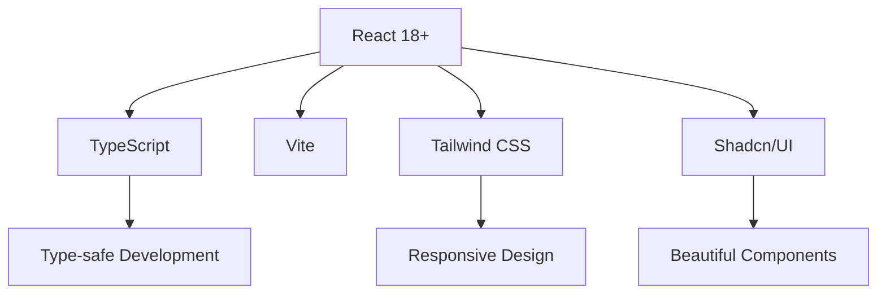
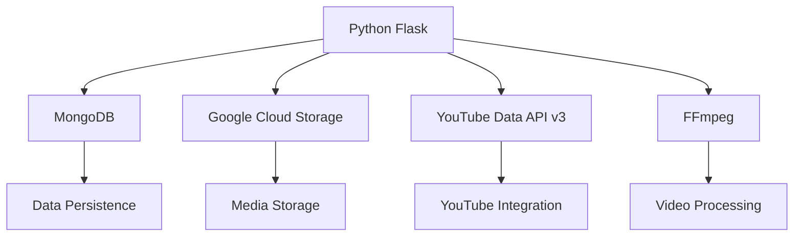

# 🚀 Lazy Creator - AI-Powered YouTube Shorts Generator


> **Transform ideas into viral YouTube Shorts in seconds!** 🎬✨

Lazy Creator is a cutting-edge full-stack web application that automates the creation of YouTube Shorts using AI. From script generation to video rendering and YouTube upload, we handle it all with a beautiful, intuitive interface.

## 🌟 Features

### 🎯 Core Capabilities
- **🤖 AI-Powered Content Generation** - Generate engaging scripts and visuals automatically
- **🎬 One-Click Video Creation** - From concept to final video in minutes
- **📱 YouTube Shorts Optimized** - Perfect vertical format for maximum engagement
- **☁️ Cloud Storage Integration** - Secure file handling with Google Cloud Storage
- **🔄 Real-time Progress Tracking** - Monitor video generation with live updates
- **🎨 Customizable Templates** - Personalize backgrounds, durations, and styles

### 🛠️ Technical Highlights
- **⚡ Lightning Fast** - Optimized video processing pipeline
- **📱 Responsive Design** - Works seamlessly on desktop and mobile
- **🔒 Secure Authentication** - Firebase-powered user management
- **📊 Analytics Ready** - Built-in monitoring and logging
- **🚀 Production Ready** - Docker containerization and cloud deployment

## 🏗️ Architecture

### Frontend Stack


**Key Technologies:**
- ⚛️ **React 18+** with TypeScript for type-safe development
- 🚀 **Vite** for lightning-fast builds and development
- 🎨 **Tailwind CSS** with **Shadcn/UI** for stunning, consistent UI
- 🔗 **React Router** for seamless navigation
- 📡 **Socket.IO Client** for real-time communication
- 🎭 **Framer Motion** for smooth animations
- 🔄 **TanStack Query** for efficient server state management
- 🔥 **Firebase** for authentication and hosting

### Backend Stack


**Key Technologies:**
- 🐍 **Python 3.10+** with **Flask** for robust API development
- 📊 **MongoDB** for flexible data storage
- ☁️ **Google Cloud Storage** for scalable file management
- 📺 **YouTube Data API v3** for seamless video uploads
- 🎬 **FFmpeg** for professional video processing
- 🔐 **JWT Authentication** for secure user sessions
- 🧵 **Background Processing** for non-blocking operations

## 🚀 Quick Start

### Prerequisites
- Node.js 18+ 
- Python 3.10+
- MongoDB Atlas account
- Google Cloud Platform account
- YouTube API credentials

### Installation

#### 1. Clone the Repository
```bash
git clone https://github.com/your-username/lazy-creator.git
cd lazy-creator
```

#### 2. Setup Frontend
```bash
cd frontend

# Install dependencies
npm install

# Configure environment
cp .env.example .env.local

# Add your Firebase configuration
VITE_API_URL=http://localhost:4000
VITE_FIREBASE_API_KEY=your_firebase_api_key
VITE_FIREBASE_AUTH_DOMAIN=your_app.firebaseapp.com
VITE_FIREBASE_PROJECT_ID=your_project_id
VITE_FIREBASE_APP_ID=your_app_id

# Start development server
npm run dev
```

#### 3. Setup Backend
```bash
cd ../backend

# Install Python dependencies
pip install -r requirements.txt

# Configure environment
cp .env.example .env

# Add your configuration
FLASK_APP=main.py
FLASK_ENV=development
SECRET_KEY=your-secret-key
MONGODB_URI=your_mongodb_uri
GOOGLE_APPLICATION_CREDENTIALS=/path/to/your/google-credentials.json
YOUTUBE_CLIENT_SECRETS=/path/to/your/client_secret.json
FRONTEND_URL=http://localhost:3500

# Start the server
python -m app.main
```

#### 4. Access the Application
- Frontend: http://localhost:3500
- Backend API: http://localhost:4000

## 📖 Detailed Documentation

### Frontend Development
For detailed frontend setup, component structure, and development guidelines, see [frontend/README.md](./frontend/README.md).

### Backend Development  
For API documentation, backend architecture, and deployment instructions, see [backend/README.md](./backend/README.md).

## 🎨 Screenshots

### Dashboard


### Video Creation Wizard


### Gallery Management


## 🔧 Configuration

### Environment Variables

#### Frontend (.env.local)
```env
VITE_API_URL=http://localhost:4000
VITE_FIREBASE_API_KEY=your_firebase_api_key
VITE_FIREBASE_AUTH_DOMAIN=your_app.firebaseapp.com
VITE_FIREBASE_PROJECT_ID=your_project_id
VITE_FIREBASE_APP_ID=your_app_id
```

#### Backend (.env)
```env
FLASK_APP=main.py
FLASK_ENV=development
SECRET_KEY=your-secret-key
MONGODB_URI=your_mongodb_uri
GOOGLE_APPLICATION_CREDENTIALS=/path/to/your/google-credentials.json
YOUTUBE_CLIENT_SECRETS=/path/to/your/client_secret.json
FRONTEND_URL=http://localhost:3500
```

## 🚀 Deployment

### Docker Deployment
```bash
# Build frontend
docker build -f frontend/Dockerfile -t lazycreator-frontend .

# Build backend  
docker build -f backend/Dockerfile -t lazycreator-backend .

# Run with docker-compose
docker-compose up -d
```

### Cloud Deployment
- **Frontend**: Deploy to Vercel, Netlify, or Firebase Hosting
- **Backend**: Deploy to Google Cloud Run, AWS Lambda, or Heroku
- **Database**: MongoDB Atlas for managed database service

## 🤝 Contributing

We welcome contributions! Please see our [Contributing Guide](CONTRIBUTING.md) for details.

### Development Workflow
1. Fork the repository
2. Create a feature branch (`git checkout -b feature/amazing-feature`)
3. Commit your changes (`git commit -m 'Add some amazing feature'`)
4. Push to the branch (`git push origin feature/amazing-feature`)
5. Open a Pull Request

## 📊 Performance

### Benchmarks
- **Build Time**: < 30s (Vite)
- **API Response**: < 200ms (Flask)
- **Video Generation**: 2-5 minutes per short
- **Memory Usage**: Optimized with background processing

### Monitoring
- Application logging with structured JSON
- Performance metrics and error tracking
- YouTube API quota monitoring
- Storage usage analytics

## 🔒 Security

- JWT token authentication with refresh mechanism
- Input validation and sanitization
- CORS configuration for API security
- Secure file upload handling
- Environment variable encryption

## 📄 License

This project is licensed under the MIT License - see the [LICENSE](LICENSE) file for details.

## 🙏 Acknowledgments

- **OpenAI** for powerful AI capabilities
- **Google Cloud Platform** for infrastructure
- **Firebase** for authentication and hosting
- **YouTube API** for video platform integration
- **React & Flask communities** for excellent frameworks

## 📞 Support

For support and questions:
- 📧 Email: support@lazycreator.com
- 💬 Discord: [Join our community](https://discord.gg/lazycreator)
- 🐛 Issues: [GitHub Issues](https://github.com/your-username/lazy-creator/issues)

---

**Made with ❤️ by the Lazy Creator Team** | [Website](https://lazycreator.com) | [Documentation](https://docs.lazycreator.com)